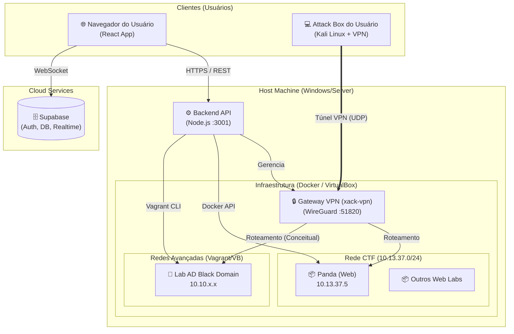
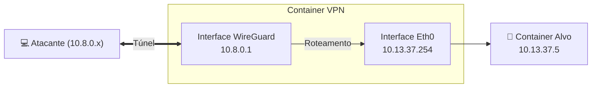
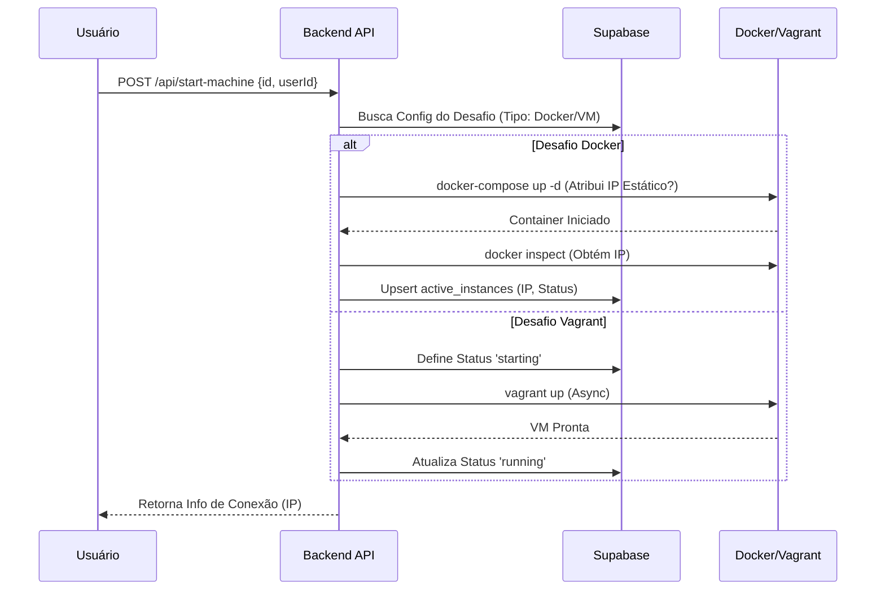

# 🏗️ Arquitetura da Plataforma XACK

Este documento fornece uma análise profunda da arquitetura técnica da plataforma de CTF XACK, detalhando a topologia de rede, interações entre componentes e fluxos operacionais.

## 🔭 Visão Geral

A plataforma consiste em um **Frontend** (React/Vite), um **Backend** (Node.js/Express) rodando no host, um **BaaS** (Supabase) para estado/auth, e uma **Camada de Infraestrutura** híbrida (Docker & Vagrant) para hospedar os desafios, acessível via uma **VPN WireGuard**.

---

## 🌐 Topologia de Rede

A plataforma utiliza uma rede interna dedicada para os desafios, garantindo isolamento e endereçamento consistente.

### 1. `ctf_net` (Docker Network)
- **Subnet**: `10.13.37.0/24`
- **Gateway**: `10.13.37.1` (Padrão Docker) / `10.13.37.254` (Gateway VPN)
- **Propósito**: Hospeda desafios Web padrão, Crypto e Pwn leves.
- **Acesso**: Acessível apenas via túnel VPN ou host local.

### 2. Rede VPN (`wg0`)
- **Subnet**: `10.8.0.0/24`
- **Servidor**: `10.8.0.1` (Dentro do container `xack-vpn`)
- **Clientes**: `10.8.0.2` - `10.8.0.254`
- **Roteamento**: Clientes são roteados para `10.13.37.0/24` através do container VPN.

### 3. Labs Avançados (VirtualBox/Vagrant)
- **Subnets**: Personalizadas por lab (ex: `10.10.10.0/24` para o BlackDomain).
- **Acesso**: Requer roteamento avançado no Host ou configuração de VPN/Bridge para alcançar adaptadores Host-Only do VirtualBox.

---

## 🔄 Fluxos Principais (Core Workflows)

### 1. Ciclo de Vida de Inicialização de Máquina

Como a plataforma lida com uma solicitação do usuário para iniciar uma máquina.

### 2. Configuração da VPN

Como os usuários obtêm acesso à rede.

1. **Geração**: O Backend interage com a API do `xack-vpn` para gerar um novo peer para o usuário.
2. **Entrega**: O usuário baixa o arquivo `.conf` via `/api/vpn/config`.
3. **Conexão**: O usuário conecta seu cliente WireGuard local. O Backend gerencia a persistência dos peers via volumes mapeados (`./vpn/config`).

---

## 📂 Estrutura de Diretórios e Responsabilidades

| Diretório | Responsabilidade |
|-----------|------------------|
| `/backend` | Servidor Node.js Express. Orquestra a infraestrutura, lida com geração de VPN, interage com Docker CLI e Vagrant. |
| `/labs` | Fonte da verdade para os desafios. Contém subpastas (`Web`, `Network`) com `docker-compose.yml` ou `Vagrantfile`. |
| `/vpn` | Configuração para o container Gateway VPN (`wg-easy`). |
| `/src` | Aplicação Frontend React (baseado em `App.tsx`, `components`). |

---

## 🛡️ Segurança e Isolamento

- **Isolamento de Desafios**: Desafios rodam em containers ou VMs. A rede `ctf_net` permite movimentação lateral (Lateral Movement) conceitual entre desafios se não houver firewall, simulando uma rede real (o IP Alvo é alcançável por qualquer um na VPN).
- **Isolamento de Usuário**: Usuários compartilham a mesma rede VPN `10.8.0.0/24` na configuração atual.
- **Rotação**: Flags são geradas dinamicamente (`uuidv4`) e injetadas via Variáveis de Ambiente (`USER_FLAG`, `ROOT_FLAG`) na inicialização do container.

---

## 🚀 Estratégia de Deploy

A plataforma é projetada para rodar em um **Host Windows** (desenvolvimento/local) capaz de executar Docker Desktop e VirtualBox simultaneamente.

- **Docker**: Gerencia o backend, VPN e desafios Web.
- **VirtualBox**: Gerencia labs pesados/complexos (Active Directory, VMs Windows).
- **Network Bridge**: Componente crítico que conecta containers Docker e redes VirtualBox à interface VPN.
